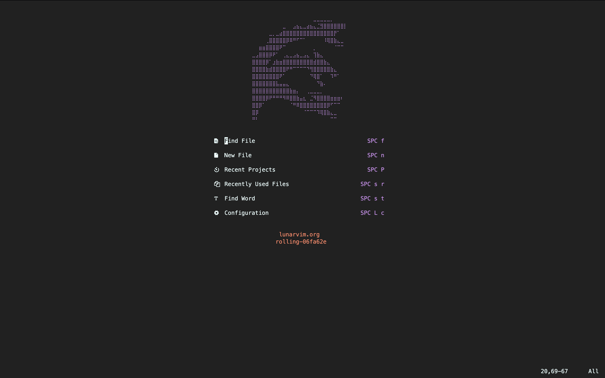
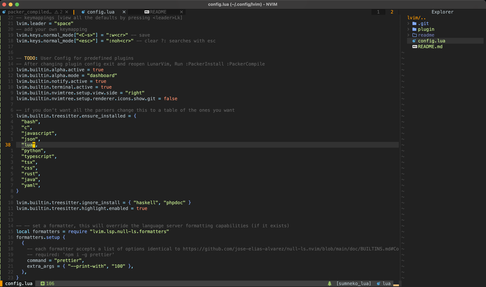

<br/><br/>

# Description

Custom <a href="https://www.lunarvim.org/)">Lvim</a> Neovim Configuration. Aiming to make Neovim usable as a replacement for VSCode

## Status

- [x] _in progress_
- [ ] _finished_
- [ ] _no longer continued_

## Table of contents

- [Description](#description)
- [Status](#status)
- [Table of contents](#table-of-contents)
- [General Info](#general-info)
- [Screenshots](#screenshots)
- [Technologies](#technologies)
- [Setup](#setup)
- [Known Issues](#known-issues)
- [Credits](#credits)

## General Info

config code:

1. Plugins are beeing loaded with packer in lua/user/plugins via "Packer"
2. general or plugin specific Configuration is loaded in lua/user/\*.
3. This config uses Mason for debugging, formatting and lsp servers.

Install LSP's, run:

```
:Mason
```

Install Treesitter Syntax highlighting, run:

```
:TSInstall all // or :TSInstallInfo for a list of installable options
```

## Screenshots

<
<

>

## Technologies

This config configures Plugins with Packer on top of the Lunarvim base-configuration. Added Configs / Plugins are:

- MesloLGSDZ Nerd Font
- catppuccin/nvim as a Theme, with integrations for the other plugins. Eg. hop, blankline...
- phazoon/hop.nvim fast motions
- lukas-reineke/indent-blankline.nvim with custom highlighting for current_context
- petertriho/nvim-scrollbar scrollbar with diagnostic indicators
- neoscroll for smooth scrolling motions
- kevinhwang91/nvim-ufo nvim-fold customization with cusmized clickable icons and highlighted fold lines
- folke/todo-comments.nvim Highlighting for Todo comments
- norcalli/nvim-colorizer.lua Color highlighting in code
- nelsyeung/twig.vim .twig file syntax highlighting
- windwp/nvim-ts-autotag autotag closing for div...
- Custom Alpha Dashboard Icon / Quote
- Null-Ls config for prettier & eslint
- DAP for NodeJS, Firefox and Rust via CodeLLDB
- gitui

## Setup

Setup neovim, lunarvim. Add this config to '~/.config/lvim'

```
rm -rf ~/.config/lvim
git clone https://github.com/JonasLeonhard/lvim-config.git ~/.config/lvim
```

add a nvim command alias to your ~/zshrc

```
:PackerSync
```

install Lazygit config + delta gitdiff view:

```
brew install lazygit
brew install git-delta
cp ./lazygit.config.yml ~/Library/Application\ Support/lazygit
mv ~/Library/Application\ Support/lazygit/lazygit.config.yml ~/Library/Application\ Support/lazygit/config.yml
```

## MacOS

The NvimRunner.app allows you to open files via Spotlight / via right click of a file -> open with.

To use the app:
copy the NVIMRunner into the /Applications folder.
The script used to generate the NvimRunner.app in Automator can be found in nvimRunner.applescript
Issues: To Update the icon, right-click and get info.

```
cp -R NvimRunner.app /Applications/
```

## Known Issues / Missing Features

---

## Credits:

I picked a lot of stuff for this config from other configs i found on Github:
If you need some more inspiration, please take a look at these configs.

- Chris@Machines nvim/lvim configs and his youtube channel were really helpful: https://github.com/ChristianChiarulli/nvim, https://github.com/ChristianChiarulli/lvim, https://www.youtube.com/chrisatmachine
- Abzcodings Config: https://github.com/abzcoding/lvim
- Gregrs-uk: Credit to open nvim via openfiles / spotlight goes to <a href="https://gregrs-uk.github.io/2018-11-01/open-files-neovim-iterm2-macos-finder/">Open files in Nvim</a>
