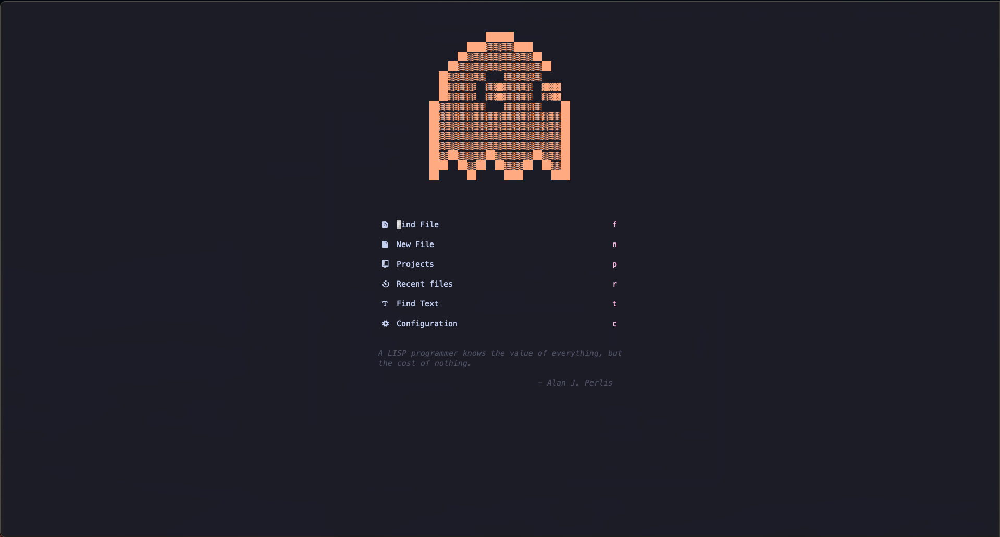
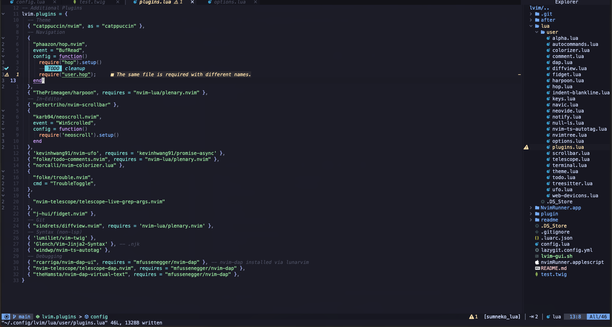

<br/><br/>

# Description

Custom <a href="https://www.lunarvim.org/)">Lvim</a> Neovim Configuration. Aiming to make Neovim usable as a replacement for VSCode

## Status

- [x] _in progress_
- [ ] _finished_
- [ ] _no longer continued_

## Table of contents

- [Description](#description)
- [Status](#status)
- [Table of contents](#table-of-contents)
- [General Info](#general-info)
- [Screenshots](#screenshots)
- [Technologies](#technologies)
- [Setup](#setup)
- [Known Issues](#known-issues)

## General Info

This Project aims to provide a personal portfolio about me and my work, aswell as a blog where
i write what comes to my mind.
UNDER CONSTRUCTION

## Screenshots

<
<

## Technologies

This config configures Plugins with Packer on top of the Lunarvim base-configuration. Added Configs / Plugins are:

- Gui Client: Neovide
- Hop Quick Search
- Material Theme
- MesloLGSDZ Nerd Font
- Sidebar To The Right
- Custom Alpha Dashboard
- Null-Ls config for prettier & eslint

## Setup

Setup neovim & lunarvim. Add this config to '~/.config/lvim'

```
git clone https://github.com/JonasLeonhard/lvim-config.git ~/.config/lvim
```

Configure Neovide and add it's custom config to your path (see. https://www.lunarvim.org/01-installing.html#tips-for-neovide-users )

## Known Issues

These are Features i want to add to this config in the Future:

```
- Theming more like Material Legacy theme [ ]
- Lualine gitblame integration [ ]
- Custom LazyGit styling  [ ]
- Neovide [x]
- uickfix space lq -> mappen to '.' like vscode? [ ]
- copy paste to cmd-v + p mappen (added to yy + p)? + move line alt+arrow? [ ]
- styled components & vue TreeSitter highlighting (Maybe styling issue?) [ ]
- fileexplorer unchangeable root dir ?maybe? [ ]
- fileexplorer view files (images) + add files from editor?, open images directly not working? [ ]
- linting ? eslint /prettier not working -> Null-ls support [x]
- eslint quickfix? [ ]
- below tabs path to components [ ]
- autosave ? [ ]
- line connectors between <div> </div> [ ]
- rainbow brackets {{}} [ ]
- collapse code ?already implemented? [ ]
- autoformat throws eslint errors eg - BuMoleculeARticleBox^
```
